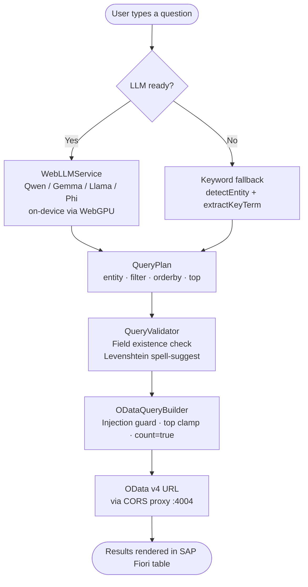
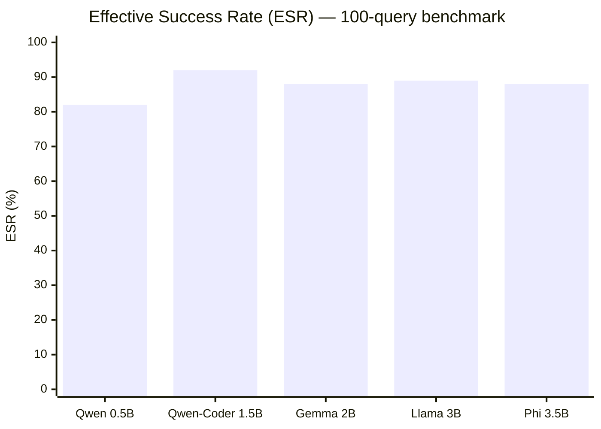

<div align="center">

# Floria — NL2OData Explorer

**Small Language Models for NL2OData: A No-Fine-Tuning Approach Validated on SAP Fiori**

*Prasanthkumar Yernagula · Independent Researcher*

[](https://github.com/Prashanthkumarpk/floria)
[](https://www.w3.org/TR/webgpu/)
[](https://openui5.org)
[](https://www.typescriptlang.org)
[](https://huggingface.co)
[](#benchmark-results)

</div>

---

Floria is a browser-based SAP Fiori application that translates plain-English questions into OData v4 queries using small language models that run **entirely on-device** via WebGPU. No query text ever reaches a remote inference server. Five models from four providers — ranging from 0.5B to 3.8B parameters, **none fine-tuned on OData** — were evaluated against a 100-item benchmark and achieved an average Effective Success Rate (ESR) of **87.8%** across five structural query types.

---

## Why This Exists

SAP chose OData as the standard data-access layer for Fiori applications. Business users who need ad-hoc reports must wait for developers to write those queries. A natural-language interface removes that bottleneck — but routing queries through a cloud LLM is often prohibited:

- Many markets SAP serves enforce **data-governance restrictions** that prohibit cloud proxies
- **HIPAA-compliant environments** explicitly forbid this pattern
- On-premises SAP systems may have **no internet egress** at all

WebGPU provides a viable alternative. It is a W3C-standardised API that lets browsers run transformer models natively on the user's GPU via Apache TVM compute shaders. WebLLM achieves throughput comparable to server-side inference on the same hardware.

The research question this project answers:

> *Can a sub-4B parameter model translate natural-language questions into valid OData v4 queries — using only schema injection at the prompt level, with no gradient updates — at accuracy levels useful in practice?*

---

## Five-Stage Pipeline



The **LLM path** is used when Qwen / Gemma / Llama / Phi has finished loading. The **direct path** runs keyword scoring immediately, so the application is fully functional even before the model is cached.

---

## Schema Injection Prompt — Four-Block Design

All five models use the **same** system prompt. No model was fine-tuned.

```
┌──────────────────────────────────────────────────────────────────┐
│                      SYSTEM PROMPT                               │
│                                                                  │
│  ┌──────────────┐  ┌──────────────┐  ┌──────────────┐  ┌──────┐ │
│  │  [ENTITIES]  │  │  [FORMAT]    │  │   [RULES]    │  │[EX-  │ │
│  │              │  │              │  │              │  │AMPLES│ │
│  │ Field names  │  │ JSON output  │  │ OData v4     │  │      │ │
│  │ and types    │  │ shape:       │  │ filter       │  │ 21   │ │
│  │ for all 7    │  │ entity,      │  │ grammar with │  │ few- │ │
│  │ Northwind    │  │ filter,      │  │ WRONG/RIGHT  │  │ shot │ │
│  │ entities     │  │ orderby, top │  │ pairs        │  │demos │ │
│  └──────────────┘  └──────────────┘  └──────────────┘  └──────┘ │
└──────────────────────────────────────────────────────────────────┘
```

**Temperature is fixed at 0.1** across all models for maximum determinism.

> **Note on structured output:** `response_format:{type:"json_object"}` is intentionally omitted. In WebLLM v0.2.84 this flag triggers a segmentation fault inside the TVM grammar compiler. The JSON structure is enforced through the prompt instruction instead — after generation, markdown fences are stripped and the first complete `{...}` block is extracted and parsed.

---

## Post-Processor — Six-Category Error Correction

Small models trained predominantly on OData v2 data produce predictable and **correctable** errors. Rather than trying to prompt away every edge case, a deterministic post-processor intercepts the model's raw output and repairs the six known failure modes before validation runs.

---

### Category 1 — OData v2 Containment Syntax

The `substringof` function is valid in OData v2 but does not exist in OData v4. Models that have seen more v2 than v4 training data default to it.

```
WRONG  substringof('chai', ProductName) eq true      ← OData v2
WRONG  substringof(ProductName, 'chai') eq true      ← reversed argument order, still v2

RIGHT  contains(ProductName,'chai')                  ← OData v4
```

The post-processor detects both argument orders and rewrites to `contains`.

---

### Category 2 — Flattened Disjunction

When asked for two values, models sometimes collapse both into a single quoted string instead of generating a proper OR expression.

```
WRONG  Country eq 'Germany or France'
                          ↑
               two values fused into one literal

RIGHT  Country eq 'Germany' or Country eq 'France'
```

The post-processor detects the pattern, splits the fused string on ` or `, and rebuilds the full OR predicate.

---

### Category 3 — Entity Name Aliasing

Models hallucinate entity names that look plausible but do not match the Northwind schema.

| Model output | Corrected to |
|---|---|
| `Catalog/Products` | `Products` |
| `OrderDetails` | `Order_Details` |
| `Order Details` | `Order_Details` |

---

### Category 4 — Field Name Aliasing

The same field concept exists under different names on different entities. Models sometimes use the generic form on an entity where a specific name is required.

```
WRONG  Country eq 'France'           ← on the Orders entity
RIGHT  ShipCountry eq 'France'       ← correct field on Orders

WRONG  ShipCountry eq 'Germany'      ← on the Customers entity
RIGHT  Country eq 'Germany'          ← correct field on Customers
```

---

### Category 5 — String Case Correction

Every string field in Northwind is title-cased. A case-insensitive containment check like `startswith(LastName,'d')` returns zero records even when matching rows exist.

```
WRONG  startswith(LastName,'d')     ← returns nothing
RIGHT  startswith(LastName,'D')     ← matches 'Davolio', 'Dodsworth', etc.
```

The post-processor title-cases the search term for `startswith` and `contains` predicates.

---

### Category 6 — Navigation Prefix Stripping

Models sometimes emit dot-notation field references copied from related schemas.

```
WRONG  Orders.ShipCountry eq 'France'
RIGHT  ShipCountry eq 'France'
```

---

> The prompt and post-processor are **identical across all five models**. Switching models requires only specifying a different WebLLM model ID — no prompt tuning per model.

---

## Schema Validator

`QueryValidator` runs after the post-processor and before URL construction. It tokenises the `$filter` expression **after stripping all quoted string literals** — an earlier version that tokenised first was generating false-positive "field not found" errors for values like `ShipCountry eq 'France'` (incorrectly flagging `France` as a field name).

For any unrecognised field it computes Levenshtein distance against every known field on that entity and surfaces the closest match within edit distance 3:

```
⚠  Field 'OrderYear' does not exist on Orders — did you mean 'OrderDate'?
```

Validation is **advisory**: the request proceeds regardless so the OData server's own error is also surfaced. Only two conditions cause a hard reject before the URL is even built:

| Condition | Why |
|---|---|
| SQL injection sequences (`;` `--` `/*` `<script`) | Defence-in-depth for OData gateways that parse filter strings |
| Sort direction other than `asc` / `desc` | Prevents malformed URLs that some gateways mishandle |

---

## Models Tested

| Model | Provider | Parameters | Download size |
|---|---|---|---|
| Qwen2.5-0.5B-Instruct | Alibaba | 0.5 B | ≈ 300 MB |
| Qwen2.5-Coder-1.5B-Instruct | Alibaba | 1.5 B | ≈ 900 MB |
| Gemma-2-2B-it | Google | 2 B | ≈ 1.5 GB |
| Llama-3.2-3B-Instruct | Meta | 3 B | ≈ 2.0 GB |
| Phi-3.5-mini-instruct | Microsoft | 3.8 B | ≈ 2.2 GB |

Weights are downloaded from HuggingFace on first launch, compiled to WebGPU shaders via Apache TVM, and cached in IndexedDB. Every subsequent launch uses the cache — cold-start after first download is under 4 seconds.

---

## Benchmark Results

**100-item benchmark · 20 queries per structural type · Northwind OData v4**  
A query is counted as **successful** if the model selects the correct entity AND the query returns at least one record.

### Query Taxonomy

| Type | Structure | Example query |
|---|---|---|
| **T1** | Entity read — no filter | *"list all suppliers"* |
| **T2** | Numeric range comparison | *"products under $15"* |
| **T3** | String match (`contains` / `startswith`) | *"products with chai in the name"* |
| **T4** | Categorical equality | *"customers from Germany"* |
| **T5** | Multi-value disjunction | *"customers from Germany or France"* |

### Per-Type Accuracy

| Model | T1 · Entity Read | T2 · Numeric | T3 · String Match | T4 · Equality | T5 · Disjunction | ESR |
|---|:---:|:---:|:---:|:---:|:---:|:---:|
| Qwen-0.5B | 85% | 90% | 55% | 90% | 90% | **82%** |
| Qwen-Coder-1.5B | 90% | 100% | 80% | 100% | 90% | **92%** |
| Gemma-2B | 95% | 90% | 65% | 95% | 95% | **88%** |
| Llama-3B | 95% | 95% | 65% | 95% | 95% | **89%** |
| Phi-3.5B | 80% | 100% | 80% | 100% | 80% | **88%** |

### Overall ESR by Model



**Key observations:**

- **T3 (string match) is the hardest category** across all models. Without fine-tuning, models default to SQL `LIKE` or OData v2 `substringof` syntax. The post-processor's Category 1 correction recovers a significant portion of these failures, but cannot recover every case.
- **T4 (categorical equality) and T2 (numeric range) are the most reliable** — the response space is tightly constrained and the few-shot examples cover them well.
- **Qwen-Coder-1.5B outperforms all larger models** with 92% ESR, suggesting that code-specialised pretraining is more valuable for query generation than raw parameter count.
- **Model portability is zero-cost** — the same prompt, post-processor, and validator ran unchanged across all five models.

---

## OData Service — Northwind v4

The benchmark and live application run against the **Northwind OData v4** public service, the canonical SAP/Microsoft reference dataset for OData demonstrations.

```
https://services.odata.org/V4/Northwind/Northwind.svc/
```

Seven entity sets are exposed, covering the full range of query structures in the benchmark:

| Entity | Key filterable fields |
|---|---|
| `Products` | `ProductName`, `UnitPrice`, `UnitsInStock`, `Discontinued`, `CategoryID` |
| `Categories` | `CategoryName` |
| `Customers` | `CompanyName`, `Country`, `City` |
| `Orders` | `ShipCountry`, `ShipCity`, `Freight`, `OrderDate` |
| `Employees` | `FirstName`, `LastName`, `Country`, `City` |
| `Suppliers` | `CompanyName`, `Country`, `City` |
| `Order_Details` | `OrderID`, `ProductID`, `Quantity`, `Discount` |

**Why a local CORS proxy is required.** Browsers enforce the Same-Origin Policy: a script served from `localhost:8081` cannot fetch from `services.odata.org` unless that server sends `Access-Control-Allow-Origin` headers — which Northwind does not. The Express proxy at `srv/server.mjs` (port 4004) forwards every request from `/odata/` to the Northwind service and injects the required CORS headers on the way back. The proxy **must be started before the Fiori dev server**.

```
Browser (localhost:8081)
        │  fetch /odata/Products?$filter=...
        ▼
CORS Proxy (localhost:4004)          ← adds Access-Control-Allow-Origin
        │  forwards to
        ▼
services.odata.org/V4/Northwind/Northwind.svc/Products?$filter=...
```

All string field values in Northwind are **title-cased** (`'Germany'`, not `'germany'`). This is one of the six post-processor correction categories — models that lowercase their string literals produce queries that match nothing.

---

## Technology Stack

| Layer | Technology | Why |
|---|---|---|
| UI framework | OpenUI5 1.130.2 | SAP standard; Fiori design system, rich data binding |
| Language | TypeScript | Type safety on OData field names; catches schema mismatches at compile time |
| AI inference | WebLLM / MLC-LLM (`@mlc-ai/web-llm`) | Runs LLM in browser via WebGPU — no server, no API key |
| OData target | Northwind v4 (`services.odata.org`) | Public, stable, well-known for SAP demos |
| CORS proxy | Express.js (`srv/server.mjs`, port 4004) | Northwind does not set CORS headers |
| Build / dev | `@sap/ui5-tooling`, `fiori run` (port 8081) | Standard SAP Fiori toolchain |

---

## Getting Started

**Requirements:** Node.js LTS · Chrome or Edge (WebGPU required — Firefox not supported)

```bash
# 1. Install dependencies
npm install

# 2. Terminal A — start the CORS proxy first
node srv/server.mjs
# Listening on http://localhost:4004

# 3. Terminal B — start the Fiori dev server
npm start
# Opens http://localhost:8081/index.html
```

**First launch:** The model (~300 MB for Qwen-0.5B, up to ~2.2 GB for Phi-3.5B) is downloaded from HuggingFace and compiled to WebGPU shaders. A progress bar tracks the download. All subsequent launches read from the IndexedDB cache.

**Switch models** by selecting a different model in the UI — each model ID maps to a different WebLLM checkpoint.

**Type-check without building:**
```bash
npx tsc --noEmit
```

---

## Project Structure

```
floria/
├── webapp/
│   ├── controller/
│   │   └── Chat.controller.ts      Pipeline orchestration · benchmark runner · session stats
│   ├── util/
│   │   ├── WebLLMService.ts        LLM lifecycle · four-block schema prompt · post-processor
│   │   ├── QueryValidator.ts       Field validation · Levenshtein spell-suggest
│   │   └── ODataQueryBuilder.ts    QueryPlan → OData v4 URL · injection guard
│   ├── view/
│   │   └── Chat.view.xml           SAP ObjectPageLayout — query · results · research dashboard
│   └── libs/web-llm/loader.js      ESM bridge: loads WebLLM into window.mlc
├── srv/
│   └── server.mjs                  Express CORS proxy (port 4004)
├── CLAUDE.md                       Full architecture reference
└── README.md                       This file
```

---

## Research Dashboard

The application ships with a live implementation of the paper's evaluation framework — no separate tooling required.

| Feature | What it shows |
|---|---|
| **Session statistics strip** | Total Queries · AI Mode · Direct Mode · Validator Catches · Server Errors · ESR % |
| **Query type classifier** | Assigns T1–T5 label to every query in real time using `classifyQueryType` |
| **Query history panel** | Timestamped entries with entity, type, validation state, timing, confidence, and success |
| **Benchmark runner** | Executes 10 embedded queries and builds a results table with entity match ✓/✗, result presence ✓/✗, and per-query timing |

---

## Known Limitations

**T3 string-match accuracy is the performance ceiling** for all sub-4B models without fine-tuning. The post-processor's `substringof` → `contains` rewrite closes part of the gap but cannot recover every case; some models still generate LIKE-style predicates that OData v4 does not support.

**No `$expand` support.** Navigation property expansion (`$expand=OrderDetails`) is not in the benchmark taxonomy and is not handled by the current schema injection prompt.

**ESR success definition has two known gaps.** A filter that returns a subset of the intended records still passes (false positive). A wrong entity that happens to return records also passes. Both are acknowledged in Section V of the paper.

**WebGPU is required.** Firefox does not support WebGPU. Use Chrome 113+ or Edge 113+. A discrete GPU is recommended for models above 1.5B parameters.

---

## Comparison with Fine-Tuned Approaches

The closest prior work is **OmniOData** (Bai et al., ACL 2026 Industry Track), which fine-tunes 1.5B and 3B Qwen2.5-Coder models in two stages (SFT then GRPO) on a synthetic corpus of 110K+ execution-verified queries. Their 3B model outperforms GPT-4o and Gemini-Pro on their internal benchmark.

| Dimension | Floria (this work) | OmniOData |
|---|---|---|
| Fine-tuning required | No | Yes (SFT + GRPO) |
| Training data needed | None | 110K+ synthetic queries |
| Runs in browser | Yes (WebGPU) | No (server-side) |
| Model size limit | ~2.2 GB (IndexedDB) | Unbounded |
| Data leaves the client | Never | Yes |
| Applicable under data regulations | Yes | Depends on deployment |

Floria is not a replacement for a fine-tuned system when training infrastructure is available. It is the viable alternative when it is not — and it substantially outperforms keyword-based fallback solutions.
